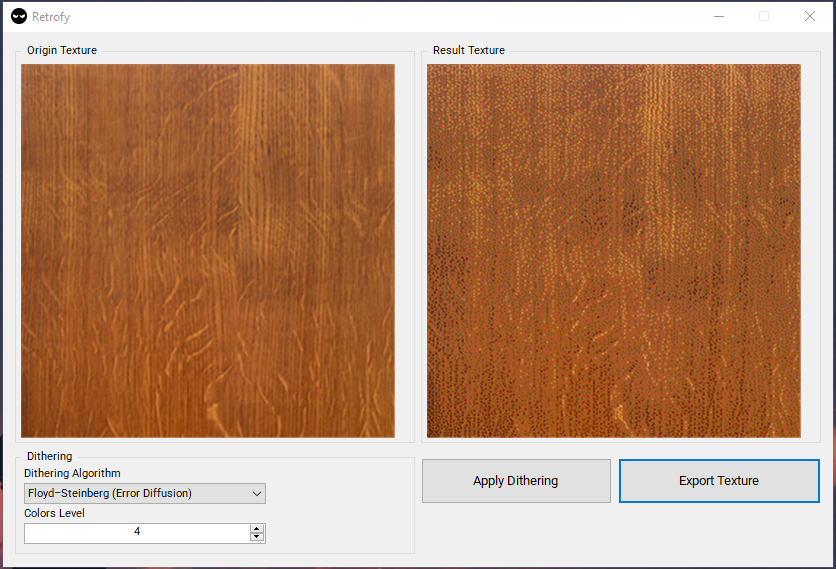

# Retrofy

A lightweight tool designed for indie developers and pixel artists to **downscale and apply retro-style dithering** to textures. It supports multiple dithering algorithms and provides a real-time preview for your images, making it perfect for creating classic pixel art or game assets.  

## Features

- **Dithering Algorithms**:
  - **Floyd–Steinberg (Error Diffusion)**
  - **Serpentine Dither**
  - **Bayer (Ordered)**
- **Customizable Intensity**: User-defined color levels.  
- **Real-time Preview**: See the results before exporting.  
- **Export**: Save textures in PNG, JPEG, or BMP formats.  

## Installation

1. Clone this repository:

```bash
git clone https://github.com/imnazake/Retrofy.git
```

## Preview

